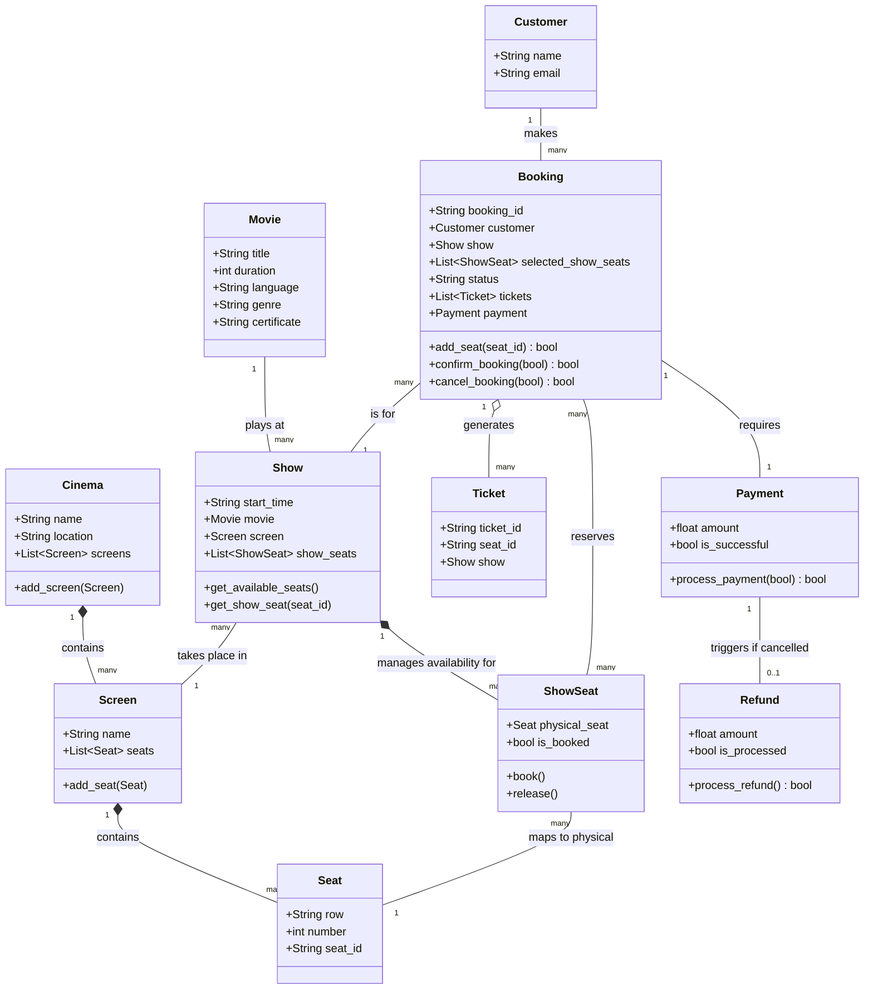

# Lab 7: Movie Ticket Booking System - Report
**Student ID:** 202401465

---

## Part A: The Core Classes (Requirement Analysis)
*What they are and why we need them.*

1. **Cinema**: The physical building. We need this because a cinema owns multiple screens.
2. **Screen**: A single room inside the cinema. It deserves its own class because it physically holds the seats.
3. **Seat**: The actual physical chair (e.g., Row A, Seat 1). It's a class because it has a specific identity and location in the room.
4. **Movie**: The film itself. Needed to store details like title, duration, and language.
5. **Show**: The most important class! It links a Movie to a Screen at a specific Time. Without this, we wouldn't know *when* a movie is playing.
6. **ShowSeat**: Tracks if a physical Seat is booked for a specific Show. (See Part C below for why this is crucial).
7. **Customer**: The person buying the tickets. Stores their name and email.
8. **Booking**: The shopping cart. It holds the customer, the show, the seats they picked, and tracks if the booking is confirmed or cancelled.
9. **Ticket**: The final pass generated *after* successful payment. It needs an ID so the customer can show it at the door.
10. **Payment**: Handles the money. Separating this means we can easily plug in a real bank API later.
11. **Refund**: Handles money returned if you cancel.

---

## Part B: The Relationships
*How the classes connect.*

*   **Cinema to Screen (1 to Many)**: One cinema building contains many screens. (Composition).
*   **Screen to Seat (1 to Many)**: One screen has many physical seats fixed inside it. (Composition).
*   **Movie to Show (1 to Many)**: One movie plays at many different showtimes. (Association).
*   **Show to ShowSeat (1 to Many)**: One show has many available/booked seats for that specific time. (Composition).
*   **Customer to Booking (1 to Many)**: One customer can make multiple separate bookings over time. (Association).
*   **Booking to Ticket (1 to Many)**: One booking can generate multiple tickets for the group. (Aggregation).
*   **Booking to Payment (1 to 1)**: One booking requires exactly one successful payment. (Association).

---

## Part C: The "Seat Availability" Catch (Design Question)

**The scenario:** If Seat A1 is booked for a 6:00 PM show, should it be blocked for the 9:00 PM show too? 

**The Humanized Answer:** *No!* A physical seat isn't permanently broken just because someone sat in it earlier. 

**The Design Solution:** We cannot store an `is_booked` flag directly on the physical `Seat` class. Instead, we introduce a new class called **`ShowSeat`**. This links a physical `Seat` to a specific `Show`, tracking if that chair is taken *for that exact time only*. This keeps the 9:00 PM show's seat completely open even if the 6:00 PM one is sold out!

---

## Part D: UML Class Diagram
*(Render this file in VS Code or any Markdown viewer that supports Mermaid to see the diagram!)*

